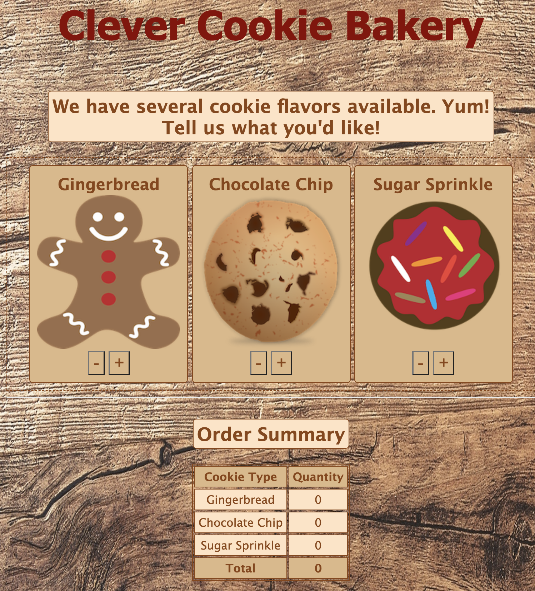

# Placement Exam (Starter Code)

Use this code as a basis for your placement exam. As always, read through the code you have before starting to write any new code. And remember, **there are no criteria that require you to alter the HTML or CSS**. You *can* alter it. We won't stop you, but we'd recommend leaving it until later. 

**Your job is to write the JavaScript code that will bring this mini-website to life!**

